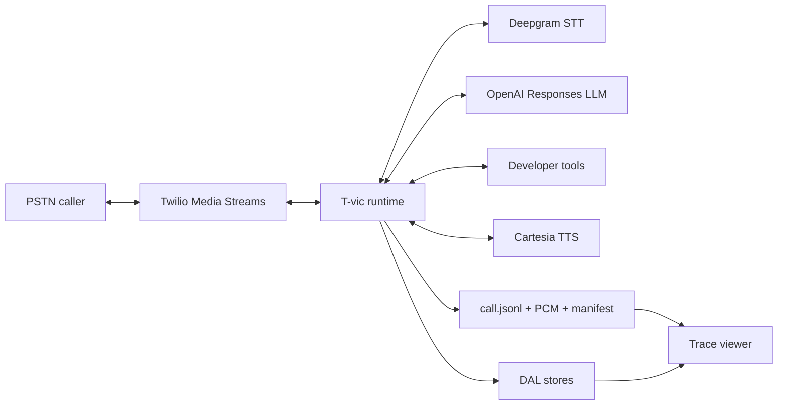
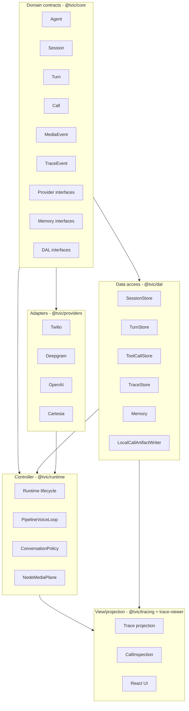
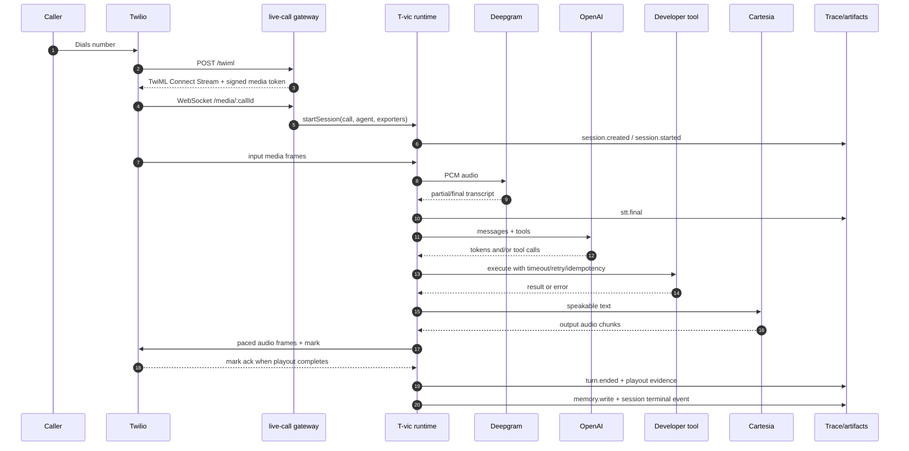
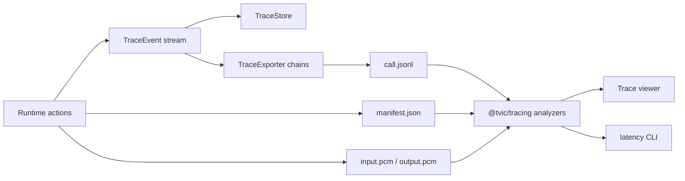

# T-vic

T-vic is a production-grade voice AI infrastructure and runtime platform.

It is not a single voice bot, call-center SaaS, no-code wrapper, telephony
company, or model lab. The core product is the infrastructure layer that makes
realtime conversational systems deployable, programmable, observable,
replayable, and reliable at production quality.

The current implementation is a TypeScript monorepo with:

- frozen runtime contracts in `@tvic/core`;
- a long-running Node runtime and media plane in `@tvic/runtime`;
- provider adapters for Twilio, Deepgram, OpenAI Responses, and Cartesia in
  `@tvic/providers`;
- tool execution, retries, cancellation, idempotency, and schema validation in
  `@tvic/tools`;
- explicit DAL implementations for sessions, turns, tool calls, memory, traces,
  and artifacts in `@tvic/dal`;
- tracing, timeline analysis, inspection models, failure classification, and
  replay segment derivation in `@tvic/tracing`;
- a live inbound call gateway in `examples/live-call`;
- a local trace viewer in `apps/trace-viewer`.

## Why T-vic Exists

Voice AI demos are easy to make look impressive. Production voice systems fail
in harder, less visible ways:

- STT, LLM, TTS, and telephony providers all stream on different clocks.
- Latency is distributed across endpointing, STT finalization, LLM TTFT, tools,
  TTS TTFB, transport, and playout.
- Callers interrupt. The runtime must stop output immediately without corrupting
  turn state.
- Tools can fail, retry, timeout, or recover without the turn itself failing.
- Audio that was sent to a socket is not always audio the caller actually heard.
- Debugging requires traces, artifacts, transcript alignment, audio replay, and
  failure explanation, not just logs.

T-vic owns the runtime boundary where all of that truth is available.



## Current Product Slice

The current slice is intentionally narrow:

> one live inbound phone call, one pipeline-mode runtime loop, complete tracing,
> complete artifact output, and a viewer that makes the call inspectable.

Pipeline mode means:

```text
Twilio -> normalized audio -> Deepgram -> T-vic turn policy -> LLM/tools
       -> Cartesia -> normalized audio -> Twilio -> caller
```

This is not because restaurant booking or inbound calls are the final product.
The workflow exists to exercise the infrastructure primitives:

- telephony ingress and egress;
- normalized media events;
- streaming STT;
- turn lifecycle;
- LLM streaming and tool calls;
- tool retries, timeout, idempotency, and validation;
- TTS streaming;
- playout confirmation;
- barge-in and cancellation;
- traces, memory, artifacts, and replay.

## Repository Map

| Path                 | Purpose                                                                                                                                       |
| -------------------- | --------------------------------------------------------------------------------------------------------------------------------------------- |
| `packages/core`      | Contract layer: IDs, entities, provider interfaces, `MediaEvent`, `TraceEvent`, policies, DAL interfaces, domain helpers. No sibling imports. |
| `packages/runtime`   | Controller/orchestration layer: runtime lifecycle, session/turn coordination, Node media plane, pipeline voice loop, conversation policy.     |
| `packages/providers` | Adapter layer: Twilio Media Streams, Deepgram STT, Cartesia TTS, OpenAI Responses LLM, provider-safe WebSocket helpers.                       |
| `packages/tools`     | Tool registry, JSON-schema subset validation, retries, idempotency, cancellation, timeout handling.                                           |
| `packages/dal`       | Persistence implementations: in-memory stores, memory implementation, trace store, local call artifact writer.                                |
| `packages/tracing`   | View/projection layer: trace exporters, event parsing, timeline derivation, call inspection, failure/incident classification.                 |
| `packages/media`     | Media buffer and direction helpers for normalized `MediaEvent`s.                                                                              |
| `packages/memory`    | Scoped in-memory memory package backed by the DAL implementation.                                                                             |
| `examples/live-call` | Real inbound call gateway: Twilio webhook + media WebSocket + runtime + real providers + artifacts.                                           |
| `apps/trace-viewer`  | Local Next.js app for call inspection, waterfalls, latency, transcripts, interruptions, and audio replay.                                     |
| `docs`               | Architecture, runtime contracts, loop plan, observability plan, and engineering audit docs.                                                   |

## How The Layers Fit



The dependency rule is deliberate:

- `@tvic/core` is the base layer and imports no siblings.
- DAL stores persistence state, not orchestration decisions.
- Runtime coordinates domain, DAL, providers, tools, and tracing.
- Providers adapt external streams into T-vic contracts.
- Tracing derives view models; React renders them and does not infer runtime
  semantics from raw events.

## Realtime Call Flow



## Event And Artifact Flow

T-vic treats observability as runtime data, not dashboard decoration.



The trace path is designed so a slow exporter cannot block realtime audio. The
artifact path is consent-gated and records what is known honestly:

- traces never inline raw audio;
- audio files contain normalized PCM;
- `manifest.json` maps payload refs to byte ranges and call-clock offsets;
- output audio is labeled as sent transport audio;
- turn playout state says whether the runtime confirmed it was heard.

## Run The Monorepo

Install dependencies:

```bash
pnpm install
```

Run the full quality gate:

```bash
pnpm lint
pnpm test
pnpm build
```

Run the live-call gateway:

```bash
pnpm --filter @tvic/example-live-call start
```

Run the trace viewer:

```bash
CALLS_DIR=examples/live-call/calls pnpm --filter @tvic/trace-viewer dev
```

For live-call setup, see [examples/live-call/README.md](./examples/live-call/README.md).
For the viewer, see [apps/trace-viewer/README.md](./apps/trace-viewer/README.md).

## Documentation

Start here:

- [docs/README.md](./docs/README.md) - documentation map and reading paths.
- [docs/system-architecture.md](./docs/system-architecture.md) - complete system
  architecture with data-flow, event-flow, DAL, adapter, artifact, and viewer
  diagrams.
- [docs/runtime-contracts.md](./docs/runtime-contracts.md) - frozen SDK/runtime
  contracts and contract freeze deltas.
- [docs/realtime-loop-plan.md](./docs/realtime-loop-plan.md) - chosen live-call
  loop, latency targets, endpointing, barge-in, artifacts, and acceptance
  criteria.
- [docs/observability-plan.md](./docs/observability-plan.md) - observability
  thesis and "Datadog for voice" product direction.
- [docs/observability-surface-v1-plan.md](./docs/observability-surface-v1-plan.md) -
  viewer analysis and UI plan.
- [docs/architecture-conventions.md](./docs/architecture-conventions.md) -
  layering, DRY, DAL, and architecture enforcement rules.

## Current Guardrails

The repository currently enforces:

- strict TypeScript production and test typechecks;
- package import boundaries via `scripts/check-architecture.mjs`;
- no production `as unknown as` escape hatches;
- no `JSON.parse(...) as Contract` casts;
- no re-declared normalized PCM format outside core constants;
- line-budget checks for architectural drift;
- Prettier over TS, TSX, JS, MJS, Markdown, and JSON;
- unit, integration, state-machine, golden, chaos, ingress-security, artifact,
  and viewer tests.

## What To Build Next

The product direction remains runtime-first:

1. keep the runtime loop honest under real calls;
2. make every runtime truth visible in the trace viewer;
3. improve endpointing/VAD and barge-in tuning from trace data;
4. add production persistence behind the DAL interfaces;
5. only then build hosted control-plane features.
