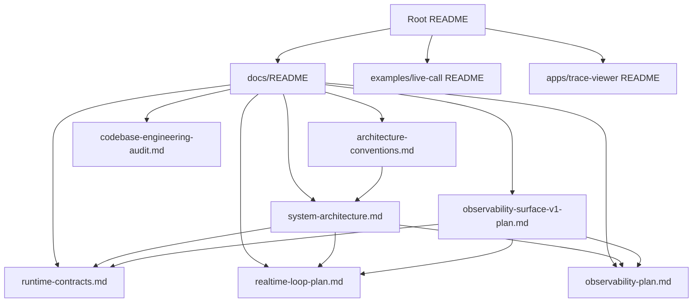
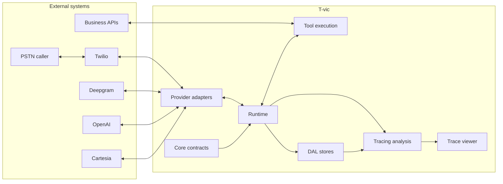

# T-vic Documentation

This folder is the working map for T-vic's runtime, contracts, architecture,
observability, and engineering rules.

If you are new to the codebase, start with the root [README](../README.md), then
read this page, then follow the path that matches what you are changing.

## Documentation Map

## Recommended Reading Paths

### New engineer

1. [Root README](../README.md)
2. [System architecture](./system-architecture.md)
3. [Runtime contracts](./runtime-contracts.md)
4. [Architecture conventions](./architecture-conventions.md)
5. [Live-call example README](../examples/live-call/README.md)
6. [Trace-viewer README](../apps/trace-viewer/README.md)

### Runtime or media-plane work

1. [Runtime contracts](./runtime-contracts.md)
2. [Realtime loop plan](./realtime-loop-plan.md)
3. [System architecture -> Runtime loop](./system-architecture.md#runtime-loop)
4. [System architecture -> Interruption flow](./system-architecture.md#interruption-flow)
5. `packages/runtime/test/*`

### Provider adapter work

1. [System architecture -> Provider boundary](./system-architecture.md#provider-boundary)
2. [Runtime contracts -> Provider](./runtime-contracts.md#provider)
3. [Realtime loop plan -> media plane](./realtime-loop-plan.md#architecture-the-media-plane)
4. `packages/providers/test/*`

### Observability or trace-viewer work

1. [Observability plan](./observability-plan.md)
2. [Observability surface v1 plan](./observability-surface-v1-plan.md)
3. [System architecture -> Event flow](./system-architecture.md#event-flow)
4. [System architecture -> Artifacts and replay](./system-architecture.md#artifacts-and-replay)
5. `packages/tracing/test/*`
6. `apps/trace-viewer/test/*`

### DAL or persistence work

1. [System architecture -> DAL segregation](./system-architecture.md#dal-segregation)
2. [Architecture conventions -> DAL](./architecture-conventions.md#2-dal--make-persistence-explicit-no-maps-in-the-controller)
3. `packages/core/src/dal.ts`
4. `packages/dal/src/index.ts`
5. `packages/dal/test/*`

### Code review or architecture audit

1. [Architecture conventions](./architecture-conventions.md)
2. [System architecture](./system-architecture.md)
3. [Codebase engineering audit](./codebase-engineering-audit.md)
4. `scripts/check-architecture.mjs`
5. `pnpm lint`

## Source Of Truth Matrix

When documents overlap, use this matrix to know which one wins.

| Topic                                                                             | Source of truth                                                                                   |
| --------------------------------------------------------------------------------- | ------------------------------------------------------------------------------------------------- |
| Entity contracts (`Agent`, `Session`, `Turn`, `Call`, `TraceEvent`, `MediaEvent`) | [runtime-contracts.md](./runtime-contracts.md) and `packages/core/src/*`                          |
| Realtime loop behavior and latency budgets                                        | [realtime-loop-plan.md](./realtime-loop-plan.md)                                                  |
| Observability product thesis                                                      | [observability-plan.md](./observability-plan.md)                                                  |
| Viewer v1 analysis and UI scope                                                   | [observability-surface-v1-plan.md](./observability-surface-v1-plan.md)                            |
| Layering, DRY, DAL, and architecture rules                                        | [architecture-conventions.md](./architecture-conventions.md) and `scripts/check-architecture.mjs` |
| Current implementation wiring                                                     | [system-architecture.md](./system-architecture.md) and package source                             |
| Live-call setup                                                                   | [examples/live-call/README.md](../examples/live-call/README.md)                                   |
| Trace viewer setup                                                                | [apps/trace-viewer/README.md](../apps/trace-viewer/README.md)                                     |

## System Overview

## Documentation Principles

Docs should follow the same standard as code:

- State what is implemented vs planned.
- Prefer diagrams for flows, ownership, and state transitions.
- Link to the owning package or source file when a claim is implementation-specific.
- Do not document fake guarantees. If a metric is unavailable, say it is
  unavailable.
- Keep contracts centralized. Do not redefine the same contract differently in
  multiple docs.
- Update docs in the same change as architecture or boundary changes.

## How To Update Docs

When a change touches architecture:

1. Update the owning source code and tests.
2. Update [system-architecture.md](./system-architecture.md) if flow, layering,
   data ownership, or package responsibility changed.
3. Update [runtime-contracts.md](./runtime-contracts.md) if a public contract
   changed.
4. Update [realtime-loop-plan.md](./realtime-loop-plan.md) or
   [observability-surface-v1-plan.md](./observability-surface-v1-plan.md) if a
   planned milestone changed.
5. Run `pnpm lint` so Markdown formatting and architecture checks run.
