# T-vic System Architecture

Status: implementation-aligned architecture guide  
Audience: engineers joining the project, reviewers, and contributors extending
the runtime  
Scope: how the current monorepo is layered, how data flows through a live call,
how events become artifacts and UI, and where persistence belongs

## One-Sentence Architecture

T-vic is a TypeScript runtime that coordinates telephony, STT, LLMs, tools, TTS,
memory, traces, artifacts, and replay through strict provider-agnostic contracts.

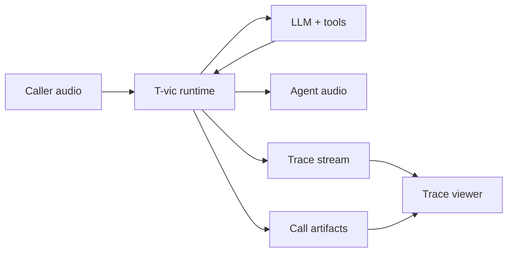

## Product Boundary

T-vic owns the runtime and infrastructure layer for production voice systems.

T-vic owns:

- agent/session/call/turn contracts;
- provider abstraction;
- normalized media events;
- the realtime orchestration loop;
- tool execution behavior;
- conversational state and memory interfaces;
- trace events, timing, artifacts, replay, and failure explanation;
- runtime reliability behavior: cancellation, retries, timeouts, playout
  confirmation, and teardown.

T-vic does not currently own:

- foundational STT, TTS, or LLM model training;
- telecom carrier infrastructure;
- a hosted enterprise dashboard;
- billing/auth/RBAC;
- a no-code workflow builder;
- a generic call-center product.

## Monorepo Dependency Graph

The dependency graph is intentionally narrow. `@tvic/core` is the base. Runtime
coordinates other packages. React renders derived view models and does not
interpret raw trace semantics.

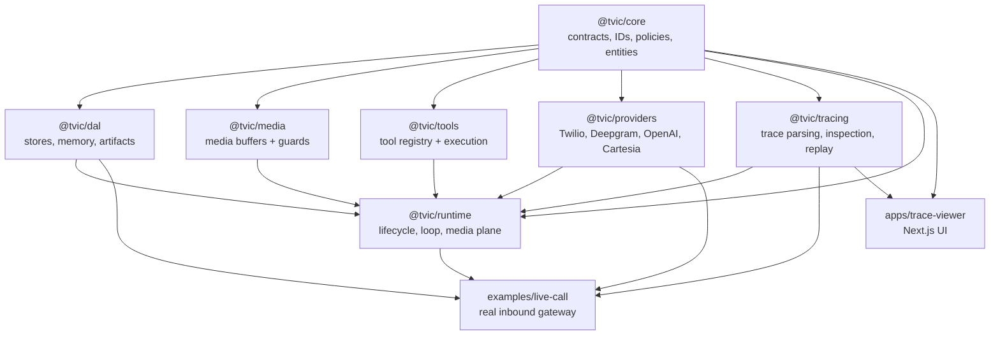

Enforced direction:

| Package             | May import                                  | Must not import                   |
| ------------------- | ------------------------------------------- | --------------------------------- |
| `@tvic/core`        | no sibling packages                         | runtime, providers, tracing, DAL  |
| `@tvic/dal`         | `@tvic/core`                                | runtime, providers, UI            |
| `@tvic/media`       | `@tvic/core`                                | runtime, providers, DAL           |
| `@tvic/tools`       | `@tvic/core`                                | runtime, providers, UI            |
| `@tvic/providers`   | `@tvic/core`, `@tvic/media`                 | runtime, DAL, UI                  |
| `@tvic/tracing`     | `@tvic/core`, `@tvic/dal`                   | runtime, providers, UI            |
| `@tvic/runtime`     | core, DAL, media, tools, tracing, providers | UI                                |
| `apps/trace-viewer` | core, tracing                               | runtime, providers, DAL internals |

## Layer Ownership

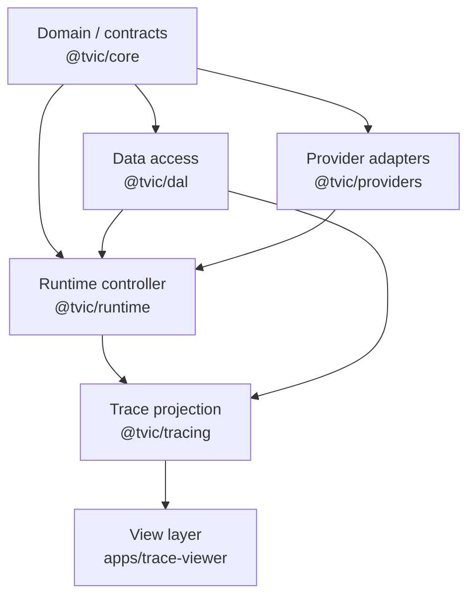

| Layer      | Owns                                                                        | Does not own                                          |
| ---------- | --------------------------------------------------------------------------- | ----------------------------------------------------- |
| Domain     | entity contracts, pure guards, policies, domain transitions                 | I/O, provider SDKs, persistence                       |
| DAL        | storing and querying sessions, turns, tool calls, traces, memory, artifacts | business decisions, provider calls                    |
| Adapters   | translating external provider streams into T-vic contracts                  | runtime state, persistence, UI                        |
| Controller | coordinating sessions, turns, providers, tools, memory, tracing             | long-term storage details, React view logic           |
| Projection | trace serialization, parsing, derived timeline/inspection/failure models    | live orchestration, provider calls                    |
| UI         | rendering view models, local UI state, audio controls                       | trace semantics, latency math, failure classification |

## Core Runtime Contracts

The runtime is built around a small set of load-bearing contracts.

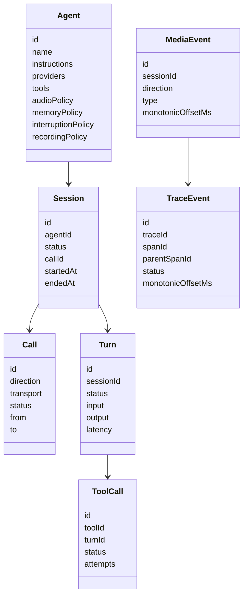

Key invariants:

- Every `Session` belongs to one `Agent`.
- A `Session` may be linked to a `Call`.
- A `Turn` is the conversational unit used by traces, latency, memory, and
  failures.
- `TraceEvent.monotonicOffsetMs` is the clock used for all latency math.
- Audio bytes are not stored in trace events.
- Tool failures can be incidents inside a completed turn; they are not always
  terminal failures.

## Runtime Loop

The current live-call path uses pipeline mode:

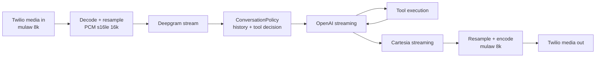

### Normal Turn Sequence

```mermaid
sequenceDiagram
  autonumber
  participant Media as Media input
  participant STT
  participant Loop as PipelineVoiceLoop
  participant Policy as ConversationPolicy
  participant LLM
  participant TTS
  participant Call as CallHandle
  participant Runtime
  participant Trace

  Media->>Loop: input audio chunks
  Loop->>STT: sendAudio(chunk)
  STT-->>Loop: stt.final transcript
  Loop->>Runtime: startTurn
  Runtime->>Trace: turn.started
  Loop->>Policy: accept transcript + history
  Policy-->>Loop: LLM messages
  Loop->>LLM: complete(messages, tools, signal)
  LLM-->>Loop: llm.token stream
  Loop->>TTS: synthesize(text, signal)
  TTS-->>Loop: output audio chunks
  Loop->>Call: send audio chunk
  Loop->>Call: send committed mark
  Call-->>Loop: playout confirmed
  Loop->>Runtime: endTurn(completed, latency)
  Runtime->>Trace: turn.ended + audio output events
```

### Tool Turn Sequence

```mermaid
sequenceDiagram
  autonumber
  participant Loop
  participant LLM
  participant Tools as @tvic/tools
  participant Tool as Developer tool
  participant Runtime
  participant Trace

  Loop->>LLM: initial pass
  LLM-->>Loop: tool call
  Loop->>Trace: tool.queued / tool.started
  Loop->>Tools: executeTool(input, timeout, retry, idempotency, signal)
  Tools->>Tool: execute
  alt success
    Tool-->>Tools: output
    Tools-->>Loop: succeeded ToolCall
    Loop->>Trace: tool.completed
  else retryable failure
    Tool-->>Tools: error
    Tools-->>Loop: retry callback
    Loop->>Trace: runtime.retry
    Tools->>Tool: retry execute
  else unrecovered failure
    Tools-->>Loop: failed ToolCall
    Loop->>Trace: tool.failed
  end
  Loop->>Runtime: recordToolCall
  Loop->>LLM: continuation with tool result or tool error
  LLM-->>Loop: response text
```

### Interruption Flow

Barge-in is a runtime behavior, not a UI feature. A turn can be cancelled after
the caller interrupts while output is active.

```mermaid
sequenceDiagram
  autonumber
  participant Caller
  participant Twilio
  participant STT
  participant Loop
  participant LLM
  participant TTS
  participant Runtime
  participant Trace

  Loop->>Twilio: output audio chunks
  Twilio-->>Caller: agent speaking
  Caller->>Twilio: starts speaking over agent
  Twilio->>STT: input audio continues
  STT-->>Loop: interim transcript while output-active
  Loop->>Trace: interrupt.detected
  Loop->>LLM: abort signal
  Loop->>TTS: abort signal
  Loop->>Twilio: cancelOutput / clear
  Loop->>Trace: output.cancelled
  Loop->>Runtime: endTurn(cancelled: barge_in)
  Runtime->>Trace: turn.ended(cancelled)
```

Important distinction:

- if output was delivered and then the caller hangs up, the turn can still be
  completed;
- if output was not heard or playout was not confirmed, the turn is cancelled
  and memory is not written as a completed exchange.

### Provider Stall / Timeout Flow

```mermaid
sequenceDiagram
  autonumber
  participant Loop
  participant Provider as LLM/TTS provider
  participant Runtime
  participant Trace

  Loop->>Provider: start stream with AbortSignal
  Provider--xLoop: no event before stall timeout
  Loop->>Trace: runtime.timeout(stage, timeoutMs, policyAction)
  alt timeout policy = fail
    Loop->>Runtime: endTurn(failed)
    Runtime->>Trace: turn.ended(failed)
  else timeout policy = interrupt
    Loop->>Provider: abort
    Loop->>Runtime: endTurn(cancelled: timeout)
    Runtime->>Trace: turn.ended(cancelled)
  end
```

## Media Plane

The media plane must run in a long-running process. It is not designed for
short-lived serverless functions.

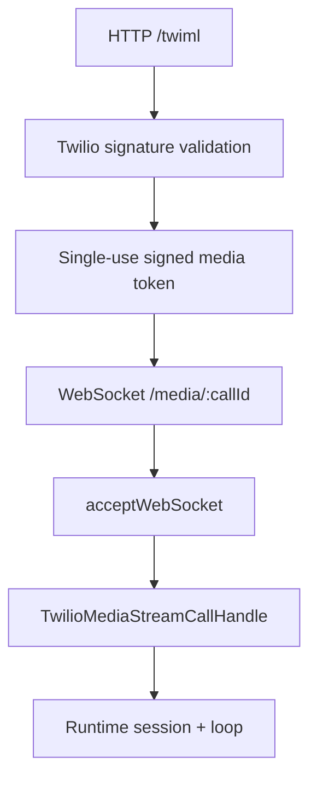

Responsibilities:

- serve TwiML for inbound calls;
- validate Twilio webhook signatures when configured;
- mint single-use media stream tokens;
- accept WebSocket connections;
- adapt Twilio frames into normalized input `MediaEvent`s;
- send normalized output chunks back to Twilio;
- send clear/cancel commands for interruption;
- confirm playout through Twilio marks where available.

## Provider Boundary

Provider adapters are transport-specific. The runtime consumes only T-vic
contracts.

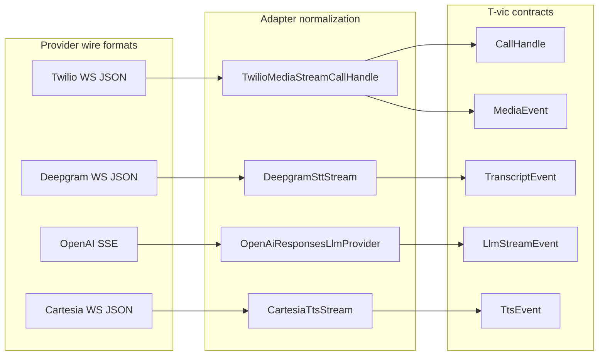

Adapter rules:

- decode provider-specific payloads at the edge;
- emit normalized PCM where the runtime expects normalized media;
- never leak provider SDK objects into `@tvic/core` contracts;
- close queues on provider close/error/cancel;
- normalize errors with provider and code metadata;
- honor `AbortSignal` where the contract provides it.

## Event Flow

Every important runtime action emits a `TraceEvent`.

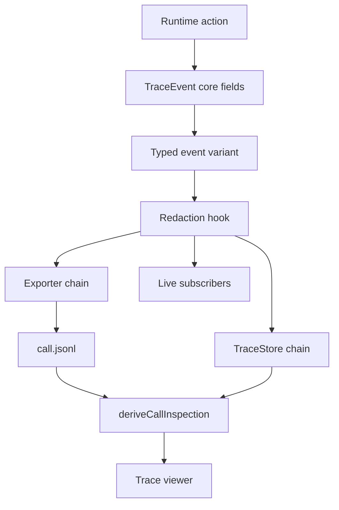

Core timing fields:

| Field               | Purpose                                             |
| ------------------- | --------------------------------------------------- |
| `timestamp`         | wall-clock ISO for display and external correlation |
| `monotonicOffsetMs` | call/session clock for all latency math             |
| `spanId`            | groups events into a waterfall span                 |
| `parentSpanId`      | expresses nesting without guessing from event order |
| `correlationId`     | groups a logical operation across events            |

Trace delivery is isolated:

- store and exporter sinks have independent ordered chains;
- one stuck sink cannot block realtime audio;
- per-sink ordering is preserved;
- flush behavior is bounded;
- session-level exporters are released only when their chains drain.

## DAL Segregation

DAL exists to keep persistence out of runtime controllers.

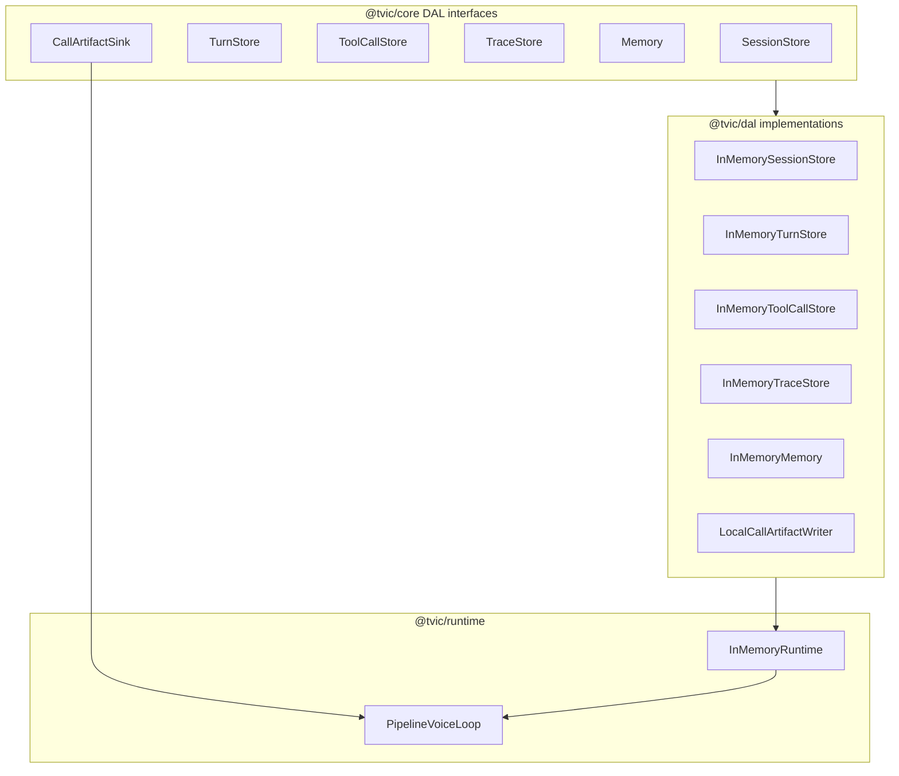

What belongs in DAL:

- storage shape;
- append/query/update/delete behavior;
- path-safety for artifact directories;
- serialized file writes and close/flush semantics;
- TTL pruning;
- memory entry storage and search.

What does not belong in DAL:

- when a turn should complete;
- whether a tool failure is recovered;
- when to interrupt output;
- provider retry decisions;
- trace span classification;
- UI failure explanations.

## Artifacts And Replay

Per-call artifacts are the bridge from runtime truth to visible debugging.

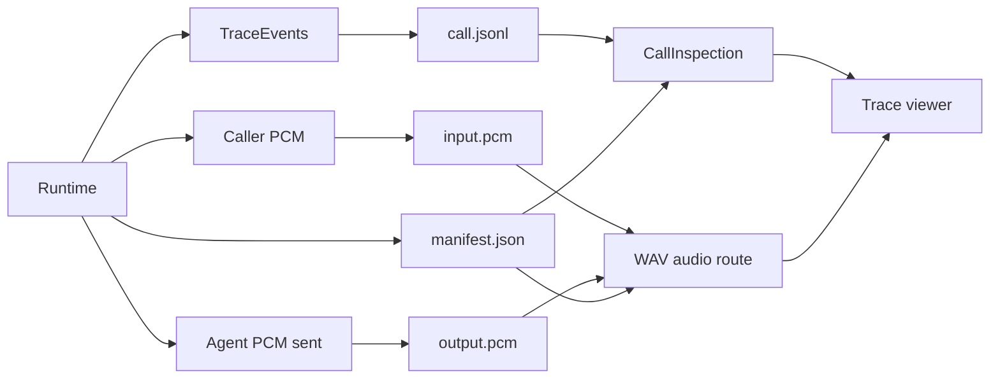

Artifact files:

| File            | Meaning                                                                                          |
| --------------- | ------------------------------------------------------------------------------------------------ |
| `call.jsonl`    | ordered trace events for the call                                                                |
| `manifest.json` | validated map of payload refs to files, byte ranges, offsets, privacy, write failures, integrity |
| `input.pcm`     | normalized caller PCM, when audio persistence is enabled                                         |
| `output.pcm`    | normalized agent audio that reached the transport, when audio persistence is enabled             |

Replay fidelity:

- input/output tracks are aligned to the same call clock used by traces;
- `agent_sent` is precise from output PCM;
- `agent_heard` is turn-level because Twilio marks confirm playout at utterance
  boundaries, not every byte;
- word-level replay is deferred until per-word timings are captured.

## Trace Viewer Data Path

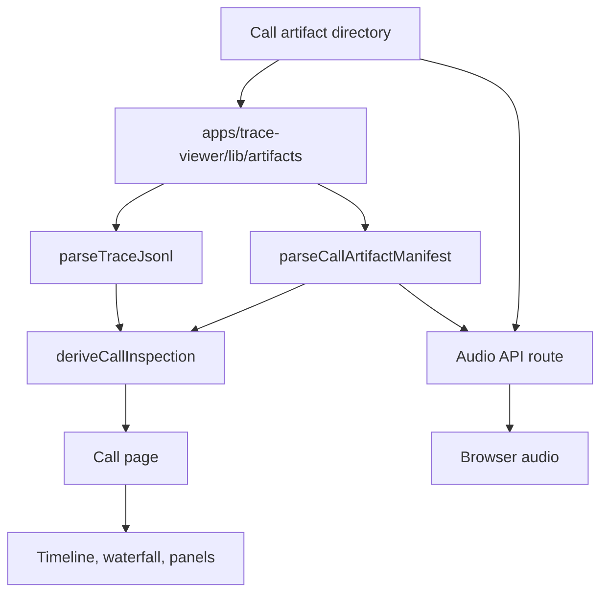

Viewer rule:

> React renders `CallInspection`. It does not parse raw trace semantics.

This keeps the frontend optimized and clean:

- fewer duplicated computations;
- stable derived models;
- no hidden runtime rules in components;
- tests live around `@tvic/tracing` analysis and viewer rendering separately.

## Failure And Incident Model

T-vic separates terminal failures from recovered incidents.

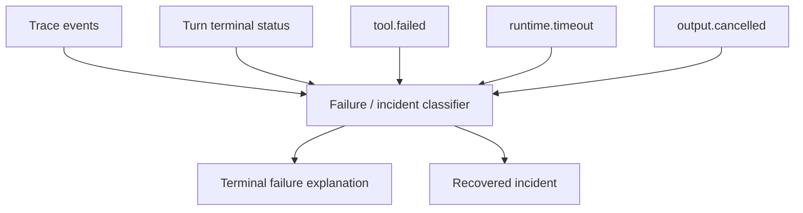

Examples:

| Situation                                     | Classification                              |
| --------------------------------------------- | ------------------------------------------- |
| `tool.failed`, model recovers, turn completes | incident on completed turn                  |
| `tool.failed`, turn later fails               | terminal failure plus unrecovered incident  |
| caller barge-in during output                 | cancelled turn, interruption failure kind   |
| output sent but playout not confirmed         | cancelled turn, playout-unconfirmed failure |
| LLM/TTS stream stalls and policy fails        | failed turn with provider-stalled evidence  |
| session fails before any turn                 | call-level failure, no fake turn            |

## State Machines

### Session Lifecycle

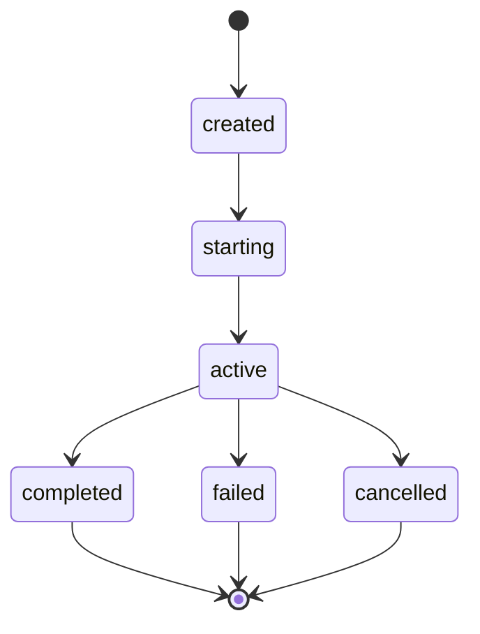

### Turn Lifecycle

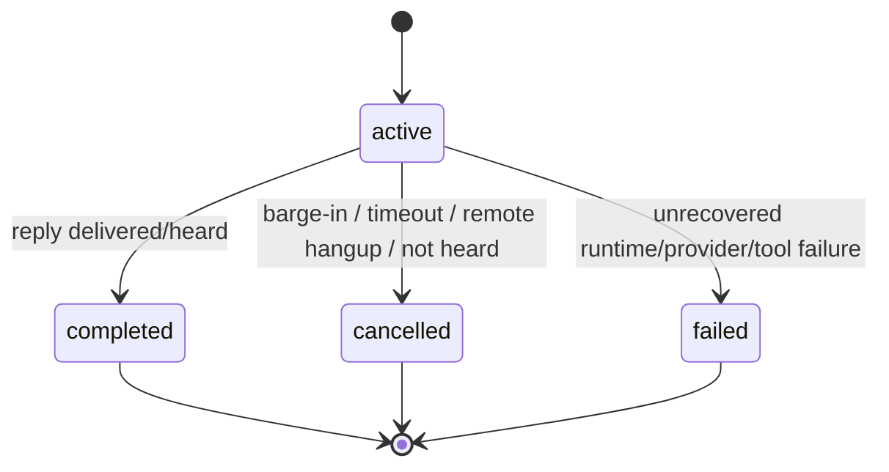

### Tool Call Lifecycle

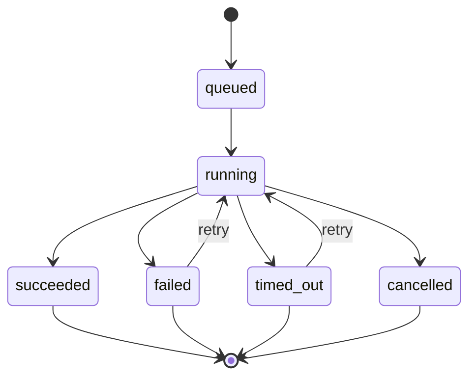

## Privacy And Trust Boundaries

The runtime handles transcripts and audio. Privacy is part of architecture.

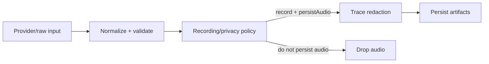

Current rules:

- recording is opt-in in the live-call example;
- audio persistence is separately gated;
- traces and artifact manifests are parsed as untrusted disk data;
- manifests are validated before being trusted;
- corrupt JSONL lines are dropped and counted;
- invalid artifacts mark calls degraded.

## Test Strategy

```mermaid
flowchart TB
  Unit[Unit tests]
  Contract[Contract tests]
  Provider[Provider adapter tests]
  Runtime[Runtime loop tests]
  Golden[Golden trace fixtures]
  State[State-machine tests]
  Chaos[Long-run chaos/leak tests]
  Ingress[Ingress security tests]
  Viewer[Viewer/artifact tests]
  Gates[pnpm lint/test/build]

  Unit --> Gates
  Contract --> Gates
  Provider --> Gates
  Runtime --> Gates
  Golden --> Gates
  State --> Gates
  Chaos --> Gates
  Ingress --> Gates
  Viewer --> Gates
```

Test families:

| Suite                   | Protects                                                        |
| ----------------------- | --------------------------------------------------------------- |
| Core contract tests     | entity and guard invariants                                     |
| Provider contract tests | startup, WebSocket, parser, stream behavior                     |
| Runtime loop tests      | happy path, barge-in, stalls, tool behavior, playout            |
| Golden trace tests      | emitted trace stream -> timeline/inspection correctness         |
| State-machine tests     | terminal states, memory, heard/cancel invariants                |
| Chaos tests             | leak resistance across randomized calls                         |
| Ingress tests           | Twilio signature, media tokens, body limits, identity binding   |
| Artifact/viewer tests   | manifest validation, audio alignment, degraded state, UI models |

## First-Time Code Tour

Use this order when reading source:

1. `packages/core/src/agent.ts`
2. `packages/core/src/session.ts`
3. `packages/core/src/turn.ts`
4. `packages/core/src/media.ts`
5. `packages/core/src/trace.ts`
6. `packages/core/src/runtime.ts`
7. `packages/core/src/dal.ts`
8. `packages/runtime/src/create-runtime.ts`
9. `packages/runtime/src/pipeline-loop.ts`
10. `packages/runtime/src/conversation-policy.ts`
11. `packages/providers/src/twilio.ts`
12. `packages/providers/src/deepgram.ts`
13. `packages/providers/src/openai-responses.ts`
14. `packages/providers/src/cartesia.ts`
15. `packages/dal/src/index.ts`
16. `packages/tracing/src/inspection.ts`
17. `packages/tracing/src/turn-analysis.ts`
18. `apps/trace-viewer/app/calls/[callId]/page.tsx`
19. `examples/live-call/src/main.ts`
20. `examples/live-call/src/gateway.ts`

## Extension Guide

### Add a provider

```mermaid
flowchart LR
  ProviderSDK[Provider SDK/wire protocol]
  Adapter[New adapter package/file]
  Contract[Core provider interface]
  Tests[Provider contract tests]
  Runtime[Runtime config]

  ProviderSDK --> Adapter
  Adapter --> Contract
  Adapter --> Tests
  Contract --> Runtime
```

Checklist:

- implement the relevant core provider interface;
- normalize external events into T-vic events;
- normalize errors with provider metadata;
- respect `AbortSignal`;
- close queues on terminal provider states;
- add parser/startup/error tests;
- do not import runtime from the adapter.

### Add a trace/viewer metric

```mermaid
flowchart LR
  RuntimeEvent[Runtime emits event]
  CoreTrace[Core TraceEvent type]
  Parser[Trace parser accepts it]
  Analyzer[Tracing derives model]
  UI[Viewer renders model]
  Test[Golden/viewer tests]

  RuntimeEvent --> CoreTrace
  CoreTrace --> Parser
  Parser --> Analyzer
  Analyzer --> UI
  UI --> Test
```

Checklist:

- make sure the runtime actually emits the backing event;
- add or update the `TraceEvent` variant in `@tvic/core`;
- update `parseTraceJsonl` validation if a new event type exists;
- derive the metric in `@tvic/tracing`;
- render the derived field in React;
- add golden tests from real loop emissions.

### Add persistence

```mermaid
flowchart LR
  Interface[Core store interface]
  Impl[DAL implementation]
  Runtime[Runtime dependency injection]
  Tests[DAL + runtime tests]

  Interface --> Impl
  Impl --> Runtime
  Impl --> Tests
```

Checklist:

- keep interfaces in `@tvic/core`;
- keep implementation in `@tvic/dal` or a DAL package;
- inject stores through runtime options;
- do not add raw persistence clients to runtime loop code;
- preserve trace flush and ordering semantics.

## Known Fidelity Limits

These are honest limits, not bugs to hide:

- endpoint delay is unavailable until local VAD/endpoint events are emitted;
- word-level audio replay is deferred until STT word timings are captured;
- `agent_heard` is turn-granular, not byte-granular;
- output artifacts are "sent to transport" audio, while trace playout state says
  whether the turn was heard;
- provider-level retries are not implemented unless explicitly emitted.

The viewer should label these limits clearly instead of inventing precision.
